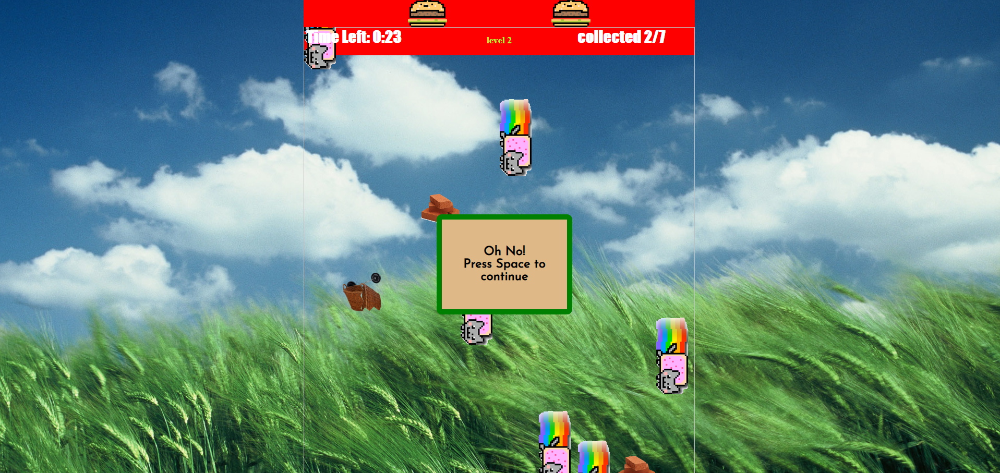
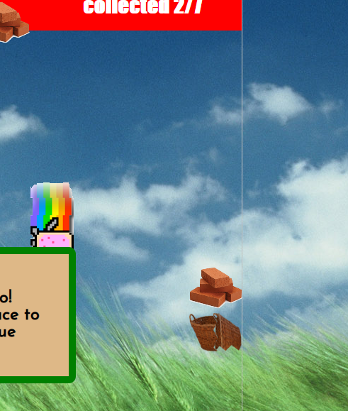
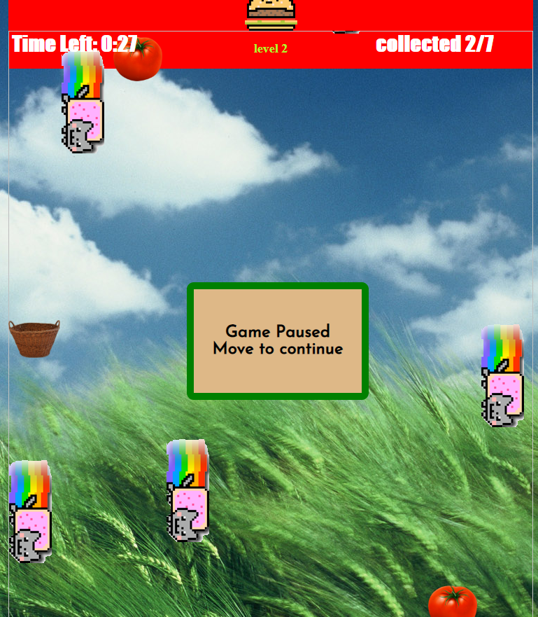
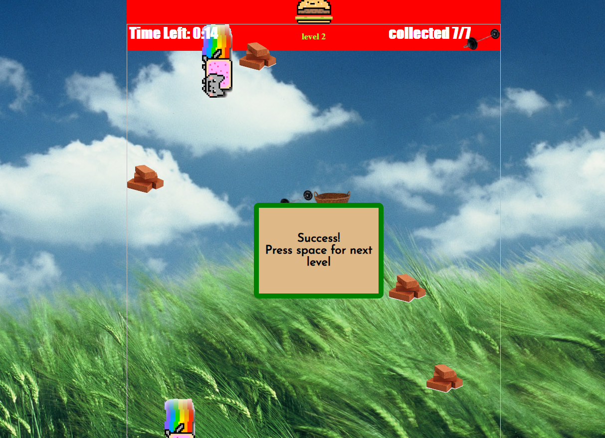

# Object Oriented Programming Game Project

## Introduction

Welcome to NyanCat field! 
collect the fruits and vegetables, but don't collect the NyanCat, barbells, or brick for thy will break your basket.

## The game

the game will start as soon as you load the page, you can change the size of the game by resizing your window, or changing the resolution.

## Instructions

1. move using the arrow keys
2. if you want to pause, press 'p' ir the space-bar.
3. on every level you will need to collect an amount of fruits and vegetables. but don't let the time run out!!!
4. once you collected the amount needed, you can start the next level - you will need to collect more, and everything goes faster. but you get more time!
5. good luck!

